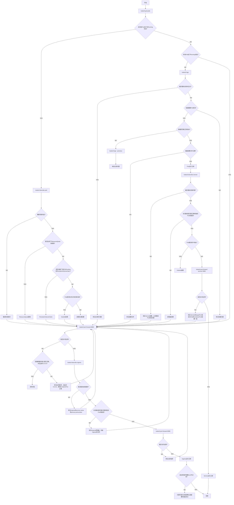

# Kubernetes FTA 故障树分析技能

## 技能简介

Kubernetes FTA 故障树分析技能是一个基于FTA（故障树分析）方法的Kubernetes问题定位工具。它提供系统化的故障排查流程，帮助用户快速定位和解决k8s环境中的各种问题。同时支持k3s轻量级Kubernetes发行版的故障排查，因为k3s和k8s的命令基本相同。

### 核心功能

- **全面的故障排查场景**：覆盖25个常见的k8s故障场景
- **系统化的排查流程**：基于FTA方法，提供 step-by-step 的排查指导
- **详细的命令和检查要点**：每个排查步骤都提供具体的kubectl命令和检查要点
- **中英文双语支持**：完全支持中英文双语操作
- **丰富的解决方案**：针对每个故障场景提供具体的解决方案

## 故障排查流程图

以下是基于FTA方法的k8s故障排查流程图（Mermaid格式）：



**来源**：[learnk8s.io](https://learnk8s.io/troubleshooting-deployments)，由 Addo Zhang 翻译

## 支持的故障排查场景

### 基础场景
- ✅ Pod状态检查（CrashLoopBackOff、Pending等）
- ✅ 资源配额问题
- ✅ 存储问题（PVC/PV）
- ✅ 镜像拉取失败
- ✅ 容器启动问题
- ✅ 网络通信问题
- ✅ Service配置问题
- ✅ Ingress配置问题
- ✅ 节点状态问题
- ✅ 容器运行时问题

### 高级场景
- ✅ OOMKilled问题
- ✅ 健康检查失败
- ✅ RBAC权限问题
- ✅ DNS解析问题
- ✅ 网络策略限制
- ✅ 容器启动超时
- ✅ 节点污点和容忍度问题
- ✅ Pod优先级和抢占问题
- ✅ HPA/VPA自动扩展问题
- ✅ Pod中断预算问题
- ✅ 集群证书过期问题
- ✅ API Server连接问题
- ✅ etcd集群问题

## 技能使用方法

1. **描述问题**：用户描述k8s集群中遇到的问题
2. **逐步排查**：技能根据FTA故障树分析流程，逐步引导用户进行排查
3. **执行命令**：针对每个排查步骤，技能提供具体的kubectl命令和检查要点
4. **反馈结果**：用户执行命令后，反馈结果给技能
5. **定位问题**：技能根据用户反馈，继续引导下一步排查
6. **解决方案**：最终定位问题并提供具体的解决方案

## 输出格式

技能提供的输出包含以下部分：

### 问题分析
- 问题现象描述
- 可能的原因分析

### 排查步骤
1. **步骤1**：执行命令和检查要点
2. **步骤2**：执行命令和检查要点
3. **步骤3**：执行命令和检查要点

### 解决方案
- 根据排查结果提供具体的解决方案
- 提供预防措施和最佳实践

## 测试用例

技能包含16个测试用例，覆盖了主要的故障场景，包括：

- Pod CrashLoopBackOff状态排查
- Service无法访问排查
- Pod Pending状态排查
- OOMKilled问题排查
- 健康检查失败排查
- RBAC权限问题排查
- DNS解析问题排查
- HPA自动扩展问题排查

所有测试用例都支持中英文双语。

## 触发条件

技能会在以下情况被触发：

- 用户遇到k8s集群问题
- 用户描述Pod运行异常
- 用户遇到服务访问失败
- 用户遇到RBAC权限问题
- 用户遇到DNS解析失败
- 用户遇到OOMKilled问题
- 用户遇到健康检查失败
- 用户遇到网络策略限制
- 用户遇到存储挂载问题
- 用户遇到HPA扩展问题
- 用户遇到API Server连接问题

技能支持中英文触发查询，确保在不同语言环境下都能被正确触发。

## 技能结构

```
k8s-fta-skill/
├── SKILL.md                    # 主技能文件（中英文双语）
├── README.md                   # 技能说明文档
└── evals/
    ├── evals.json             # 测试用例（16个，中英文双语）
    └── trigger_eval.json      # 触发评估（60个，中英文双语）
```

## 总结

Kubernetes FTA 故障树分析技能是一个强大的k8s故障排查工具，它基于FTA方法提供系统化的排查流程，覆盖了k8s集群中几乎所有常见的故障场景。通过使用此技能，用户可以快速定位和解决k8s环境中的各种问题，提高故障排查效率。

技能支持中英文双语，适用于不同语言背景的用户。它提供了详细的命令和检查要点，以及具体的解决方案，帮助用户一步步排查和解决问题。

无论是基础的Pod状态问题还是高级的集群组件问题，此技能都能提供有效的排查指导，是k8s运维人员的得力助手。